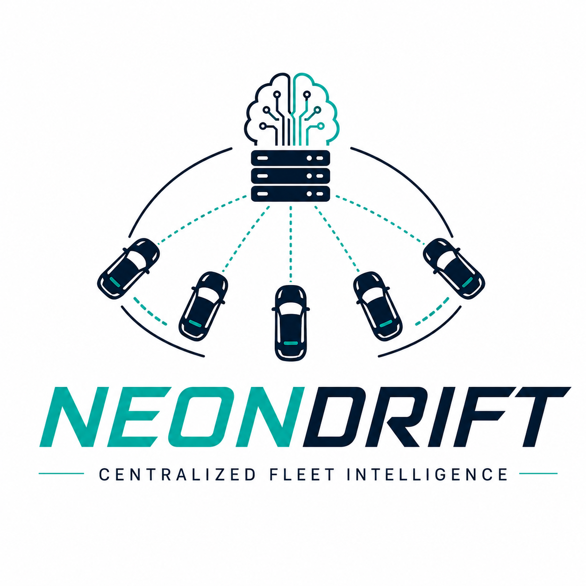

<div align="center">
  
  <h1>NeonDrift: Centralized Fleet Intelligence</h1>
  <p><b>A high-performance, full-stack Reinforcement Learning application prototyping a centralized server architecture for real-time autonomous agent coordination.</b></p>

  <br/>

  [](https://python.org)
  [](https://fastapi.tiangolo.com)
  [](https://reactjs.org)
  [](https://onnxruntime.ai)
  [](https://stable-baselines3.readthedocs.io)
  [](https://docker.com)
  [](https://github.com/Tirthgandhi05/NeonDrift_RL_RachingCar/releases/latest)

</div>

<br/>

## 📖 The Architecture Problem

How do you efficiently coordinate a large fleet of autonomous agents in a dynamic environment — like a warehouse sorting system or a campus cab service — using a single centralized brain, without putting an expensive GPU on every unit?

NeonDrift prototypes the core server architecture for this problem using a racing simulation as the testbed. The agents are intentionally "dumb" terminals — equipped only with a 1D LiDAR array, speed sensor, and compass — streaming lightweight telemetry to a **Centralized AI Server**. The server processes observations from the entire fleet simultaneously, runs RL inference in a single batched pass, and streams back precise steering and throttle commands at **30 Hz** per agent.

Because the environment is procedurally generated on every reset, the agent cannot memorize layouts. It must learn generalizable rules of navigation and collision avoidance — exactly the property required for real-world deployment.

---

## 🏗 Full-Stack Architecture

| Layer | Technology | Description |
|-------|------------|-------------|
| **Frontend** | React + Vite | Neon-cyberpunk telemetry dashboard with HTML5 canvas rendering and live scrolling graphs. |
| **Backend** | FastAPI + Socket.IO | High-concurrency event-driven server. Manages connections, batches observations, and streams 30 Hz physics updates. |
| **Inference Engine** | ONNX Runtime | Batched PyTorch models exported to ONNX to bypass the Python GIL and execute fleet-wide inference in a single C++ call. |
| **Simulation** | Custom Gymnasium Env | Fully vectorized NumPy LiDAR raycasting and Catmull-Rom spline track generation. |

> **No computer vision. No pixels. No CNNs.**
>
> Agents navigate purely using a simulated 1D LiDAR (7 ray distances) alongside internal telemetry (speed, steering angle, track progress, and heading alignment) — an 11-element observation vector.

---

## ⚡ Technical Architecture

Three optimizations were required to hit a stable 30 Hz tick rate under concurrent load:

1. **Vectorized Physics Engine:** LiDAR raycasting checks 7 rays against 1,200 track boundary segments per agent per tick. Rewritten using NumPy broadcasting — all intersections computed in a single C-level matrix operation — dropping execution time to **<1ms per agent**.

2. **Batched ONNX Inference:** Sequential PyTorch inference per client blocked the asyncio event loop; thread pools caused GIL lock contention. All three trained models (PPO, A2C, DQN) are exported to ONNX. On every tick, observations from all active clients are stacked into a single `(N, 11)` matrix and passed to `BatchedONNXPolicy` — the ONNX Runtime evaluates the entire fleet in one C++ forward pass, entirely outside the Python GIL.

3. **Pre-computed Track Pool:** Procedurally generating 1,200-segment Catmull-Rom splines at crash-time would freeze the server. Inspired by OS thread pool patterns, a `TrackPool` pre-computes and caches 100 validated tracks at startup. Agent crashes pull instantly from the pool with zero runtime overhead.

---

## 🧠 The RL Ablation Study

Three algorithms trained using `Stable Baselines3` to demonstrate the effect of policy update strategy:

| Algorithm | Key Property | Observed Behaviour |
|-----------|-------------|-------------------|
| **DQN (Discrete)** | Quantized action space (9 buckets) | Jerky steering; struggles with smooth corner lines |
| **A2C (Continuous)** | No trust-region clipping | Fast early learning; unstable on unseen tracks |
| **PPO (Continuous)** | `clip_range=0.2` constraint | Monotonic improvement; smooth generalization to new layouts |

All three models are exported to ONNX and selectable live from the frontend — switch between them without restarting the server.

---

## 💻 Local Development

> **Pre-trained models:** Download the ONNX files from the [latest release](https://github.com/Tirthgandhi05/NeonDrift_RL_RachingCar/releases/latest) and place them in the `models/` directory. The server loads them automatically on startup. Alternatively, train from scratch using the scripts below.

**With Docker:**
```bash
git clone https://github.com/Tirthgandhi05/NeonDrift_RL_RachingCar.git
cd NeonDrift_RL_RachingCar
docker-compose up --build
```
- Frontend → `http://localhost:5173`
- Backend → `http://localhost:8000`

**Without Docker:**
```bash
# Backend
python -m venv venv && source venv/bin/activate
pip install -r requirements.txt
USE_ONNX=1 uvicorn backend.app.main:socket_app --host 0.0.0.0 --port 8000

# Frontend (new terminal)
cd frontend && npm install && npm start
```

---

## 🏋️ Train Your Own Models

```bash
# Train (run any or all three)
python train/train_ppo.py
python train/train_a2c.py
python train/train_dqn.py

# Export all three to ONNX
python train/export_onnx.py

# Compare across 20 random tracks
python train/compare_algorithms.py
```

### Load Testing
```bash
# Spawn 20 simultaneous autonomous agents for 10 seconds
python backend/tests/load_test.py --clients 20 --duration 10
```

---

## 📁 Project Structure

```
NeonDrift/
├── backend/
│   ├── app/
│   │   ├── main.py                      # FastAPI app, startup, track pool init
│   │   ├── engine.py                    # 30 Hz central game loop
│   │   ├── sockets.py                   # Socket.IO events: connect, set_model, reset
│   │   ├── state.py                     # Shared server state
│   │   └── inference/
│   │       ├── onnx_batch_policy.py     # BatchedONNXPolicy — fleet inference in one C++ call
│   │       └── model_manager.py         # Model + VecNormalize loader
│   └── tests/
│       └── load_test.py
├── train/
│   ├── train_ppo.py / train_a2c.py / train_dqn.py
│   ├── export_onnx.py                   # SB3 → ONNX export for all three models
│   └── compare_algorithms.py
├── frontend/
│   └── src/
│       ├── App.jsx                      # Model selection → simulation screen
│       ├── components/
│       │   ├── RaceCanvas.jsx           # HTML5 Canvas: track, car, LiDAR rays
│       │   └── TelemetryPanel.jsx       # Right panel: gauges, graphs, state vector
│       └── hooks/useSocket.js
├── models/                              # Place downloaded ONNX files here
├── docker-compose.yml
└── requirements.txt
```

---

## 📡 Observation Space

| Index | Signal | Range |
|---|---|---|
| 0–6 | 7 LiDAR ray distances (normalised) | [0, 1] |
| 7 | Speed (normalised) | [0, 1] |
| 8 | Steering angle | [−1, 1] |
| 9 | Track progress | [0, 1] |
| 10 | Heading alignment | [−1, 1] |

## 🎯 Reward Structure

| Component | Formula | Purpose |
|-----------|---------|---------|
| **Time penalty** | `-0.1` per step | Forces the agent to navigate efficiently |
| **Progress reward** | `+1.0 × Δprogress` | Rewards advancing along the track centerline |
| **Speed bonus** | `+0.05 × speed` | Secondary speed signal |
| **Smoothness penalty** | `-0.05 × \|Δsteer\|` | Discourages jerky control |
| **Collision** | `-10` (terminal) | Crash ends the episode |

---

## Author

**Tirth Kaushal Gandhi** — B.Tech. (Honours) ICT, Dhirubhai Ambani University  
[LinkedIn](https://linkedin.com/in/TirthGandhi) · [GitHub](https://github.com/Tirthgandhi05)
